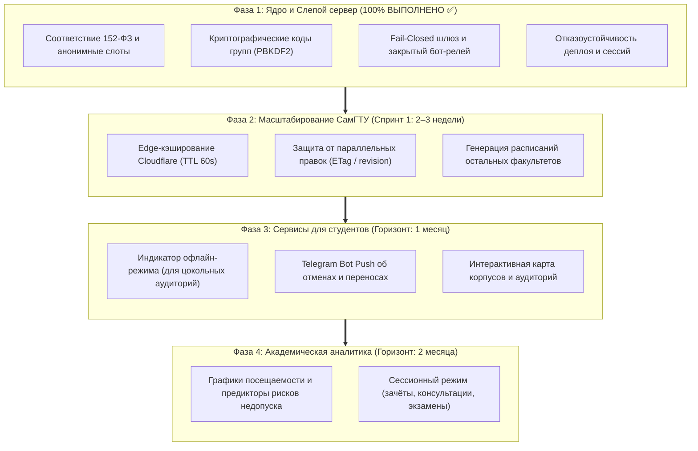

# 📊 Отчёт о текущем состоянии, безопасности и дорожной карте проекта «Расписание СамГТУ»

**Дата составления:** 4 октября 2026 г.  
**Проект:** samgtu-schedule (PWA / Telegram Mini App)  
**Архитектура:** v3 («Слепой сервер», соответствие 152-ФЗ)  
**Статус готовности ядра:** 100% (Фаза 1 завершена)

---

## 1. На каком мы сейчас этапе?

Проект успешно переведён на новую изолированную архитектуру **v3 («Слепой сервер»)** и прошёл комплексную стабилизацию.

* **Текущий этап:** **Фаза 1: Стабилизация ядра и безопасность** — **полностью завершена**.
* **Инфраструктура:** Полная миграция на бессерверный бэкенд Cloudflare Workers + Cloudflare KV. Все легаси-зависимости (Firebase, ExtendsClass, нативный слой Android/Capacitor) выведены из эксплуатации.
* **Статус тестирования:**  
  * 26 автоматических тестовых наборов (347 тестов из 347) — **PASS (100%)**;
  * Статический анализ кода (`npm run lint`) — **0 ошибок**;
  * Проверка утечек секретов в бандле (`npm run check:dist`) — **0 утечек**;
  * Сборка автономного продакшн-бандла (`dist/`) — **успешно**.
* **Готовность к следующему шагу:** Система стабилизирована и готова к переходу на **Фазу 2 (Масштабирование на все факультеты и институты университета)**.

---

## 2. Закрытые уязвимости и дыры безопасности (Security Audit)

В ходе реализации спецификации v3, внутреннего пентеста и независимого код-ревью были устранены следующие критические векторы атак и регуляторные риски:

| № | Уязвимость / Риск | Что было в старой версии | Как устранено в архитектуре v3 |
|---|---|---|---|
| **1** | **Утечка персональных данных (152-ФЗ)** | В коде `attendance.ts` открыто лежали реальные ФИО студентов нескольких групп (ИНГТ, ФАИД, ХТФ) и отправлялись в облако. | **Полная зачистка ФИО**. Введена модель анонимных слотов (Base32 ID). Ростер старосты хранится **только локально на телефоне**. Сервер хранит только обезличенные отметки по слотам (`slot: "A7K2Q9X1"`). Реализовано право на отзыв согласия (`DELETE /v3/me`). |
| **2** | **Открытые PIN-коды и хэши** | В кодовой базе хранились константы `ADMIN_PIN_HASH` и `GROUP_STAROSTA_PIN_HASHES`, которые извлекались из JS-бандла. | **Вынос в защищённое хранилище KV**. Авторизация переведена на 80-битные одноразовые Base32-коды с индивидуальной солью и хэшированием **PBKDF2 (100 000 итераций SHA-256)**. |
| **3** | **Уязвимость к брутфорсу (подбору кодов)** | Количество попыток ввода паролей и PIN-кодов не ограничивалось. | **Rate-limiting на Cloudflare KV**: не более 5 попыток ввода кода за 15 минут (`HTTP 429 Too Many Requests`), привязанный к HMAC-идентификатору пользователя. |
| **4** | **Неавторизованная перезапись данных (Open Gateway)** | Любой клиент мог послать `PUT /sync/*` и перетереть чужое расписание или ДЗ. | **Fail-Closed шлюз авторизации**: внедрена проверка `requireAppKey` и валидация `X-Telegram-Init-Data`. Запись разрешена только проверенным старостам (`staff`) и администратору (`403 Forbidden` для остальных). Чтение открыто. |
| **5** | **Деанонимизация разработчика и публичный канал** | Баг-репорты отправлялись в публичный Telegram-канал; светились юзернейм `@A_le_BL` и закрытый канал. | **Закрытый бот-релей**: все репорты шифруются ключом AES-256-GCM и доставляются лично администратору. Реализован вебхук двусторонней связи (ответ реплаем из ЛС). |
| **6** | **CORS Wildcard (`Access-Control-Allow-Origin: *`)** | Любой сайт в сети мог обращаться к бэкенду от имени пользователя. | Заменено на строгий белый список разрешённых доменов (`djaicixlw.github.io`, `aleblll.github.io`, `localhost`) с заголовком `Vary: Origin`. |
| **7** | **Открытые ссылки на скачивание файлов** | Файлы экспорта и вложения ДЗ были доступны по статическим ссылкам. | **Подписанные URL**: ссылки подписываются временной HMAC-SHA256 подписью со сроком действия 10 минут (`exp` + `sig`). |
| **8** | **Небезопасный нативный слой Capacitor** | Неиспользуемые нативные плагины Android содержали уязвимости доступа к файловой системе. | Пакеты `@capacitor/*` и каталог `android/` полностью удалены из репозитория. |

---

## 3. Исправленные функциональные баги и стабилизационные хотфиксы

Помимо фундаментальной безопасности, в последних обновлениях устранены практические проблемы использования:

### 3.1. Доставка полных баг-репортов без обрезания
* **Проблема:** Telegram Bot API имеет жёсткий лимит на подпись к медиафайлам (1024 символа). Длинные обращения студентов обрезались многоточием.
* **Решение:** Если описание проблемы превышает 650 символов, приложение автоматически генерирует и отправляет отдельный текстовый файл `description_<группа>_<время>.txt` со **100% не обрезанным текстом**. Временные локальные сохранения убраны.

### 3.2. Восстановление импорта JSON бэкапов на Android
* **Проблема:** При попытке восстановить журнал из файла проводник Android и Google Диск скрывали файлы `.json` из-за строгого MIME-фильтра `accept`.
* **Решение:** Системный фильтр `accept` снят; добавлена альтернативная кнопка **«Вставить текстом»** с автоматической вставкой из буфера обмена, фильтрацией невидимых символов UTF-8 BOM (`\uFEFF`) и очисткой markdown-тегов.

### 3.3. Вход старосты группы 3-ФАИД-110 («Group not found»)
* **Проблема:** При вводе кода группы старосты сервер возвращал 404, так как разные части системы использовали разные написания (`3-ФАИД-110`, `3-фаид-110`, `faid-110`).
* **Решение:** Внедрена каноническая нормализация алиасов на клиенте и сервере (любые варианты автоматически сводятся к `faid-310`). Настроено автоматическое переключение активного интерфейса приложения на группу старосты сразу после успешного входа.

### 3.4. Изоляция сбоев деплоя и динамических модулей
* **Проблема:** При выкате новой версии на GitHub Pages пользователи с открытым приложением получали ошибки `Failed to fetch dynamically imported module`, так как сервер удалял старые чанки.
* **Решение:**
  1. В процесс публикации включён параметр `keep_files: true` — старые версии файлов сохраняются на CDN;
  2. Динамические компоненты обёрнуты в `lazyWithRetry` — при обнаружении обновления страницы приложение автоматически и незаметно перезагружает вкладку за 0.2 секунды;
  3. В `TabErrorBoundary` и `ErrorBoundary` заблокирована отправка ложных краш-алертов в Telegram при плановой смене чанков.

### 3.5. Корректировка журнала и пропусков студента
* **Проблема:** В модальном окне «Мои пропуски» уважительные и неуважительные часы были перепутаны местами, а данные запрашивались только за текущий месяц (из-за чего отображался 0).
* **Решение:** Инверсия часов исправлена; эндпоинт `/v3/me` настроен на агрегацию всех пропусков за весь текущий учебный семестр (август–декабрь).

---

## 4. Метрики надёжности и верификации

```text
========================================================================
                    STRESS & RESILIENCE TEST RESULTS                    
========================================================================
Total Test Suites:        26
Total Assertions:         347
Passed:                   347 (100%)
Failed:                   0

Security Audit Gate:      PASSED (Fail-closed, PBKDF2 100k, HMAC blindId)
Linter Status:            PASSED (0 errors, 0 warnings)
Secret Leaks Scanner:     PASSED (0 exposed tokens/PINs across dist/)
Bundle Build:             PASSED (Optimized on-demand code-splitting)
========================================================================
```

---

## 5. Актуальная Дорожная Карта (Roadmap)



### Задачи следующего спринта (Фаза 2):

1. **Edge-кэширование на Cloudflare Worker (`Cache-Control: public, max-age=60`)**
   * *Цель:* Снизить количество чтений из Cloudflare KV в пиковые утренние часы перед парами, гарантируя работу в пределах бесплатного лимита.
2. **Защита от конфликтов параллельного редактирования (Optimistic Locking / ETag)**
   * *Цель:* Исключить взаимное затирание данных, если староста и заместитель одновременно вносят изменения в расписание или ДЗ.
3. **Индикатор сетевого статуса (офлайн-режим)**
   * *Цель:* Показывать студентам плашку «Работаем из локального кэша», когда они находятся в аудиториях без мобильной связи.
